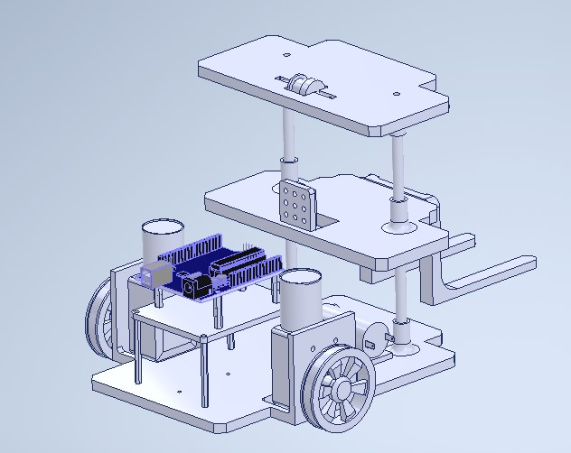
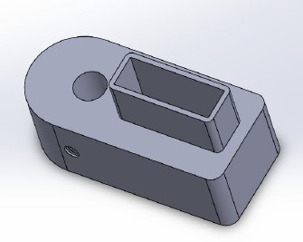
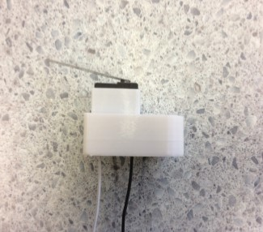
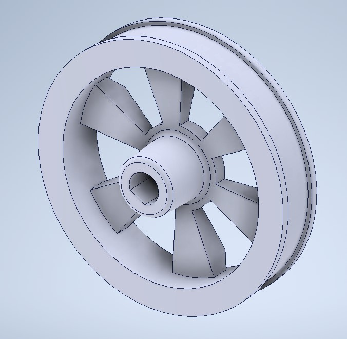

# 3D Designs

## Intro
All parts for my robot (apart from the electrical components) were custom designed and 3D modelled using SOLIDWORKS and then 3D printed. This process was highly iterative and as a result it took quite a few attempts to get my desired end result. All 3D models are provided under `/models` and can be opened using SOLIDWORKS or Autodesk Inventor.

## Screenshots
Due to the amount of parts, I can't include screenshot of all parts but here are a select few:

### Robot assembly (`Full assembly.SLDASM`)
  
_The space at the bottom of the Arduino mount is for the battery pack :)_

### Limit Switch Trigger (`Limit switch trigger (for top).SLDPRT`)

#### Model

### Final product

### Wheel (`Wheel (New).SLDPRT`)

### Forklift (`Forklift - Front (v2).SLDPRT`)
