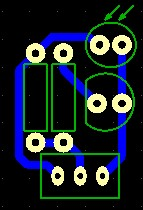

# PCB Designs

## Intro
For my robot, I had designed and produced two PCBs - a main PCB shield that plugs into an Arduino Uno, and a tiny sensor board that just contains an LDR and an LED. The PCBs were fabricated using a monoFab SRM-20 desktop CNC mill.

## Main PCB

This is the main circuit for my robot which is a shield that just plugs into an Arudino Uno.  

The two chips are `L293D` motor drivers used to power the two main motors of the robot + the pulley motor for the forklift. In the bottom-left, the four 3-pin headers are for my light sensors, and these connect to the Arduino's analog-in ports. The four-pin header at the bottom is for the bluetooth module which is connected to pins `0` and `1` for `RX/TX`. In the top-right, the two small two-pin headers are for the limit switches which allow me to determine programatically when the forklift has reached the top/bottom. Finally, the two larger two-pin headers in the top-left are for the main motors and middle one is for the pulley motor.

## Sensor PCB

This is the sensor circuit for my robot which plugs into my main PCB shield.

This circuit simply contains an LED, LDR, and a 3-pin header which allows me to connect the sensor PCB to the main PCB shield.